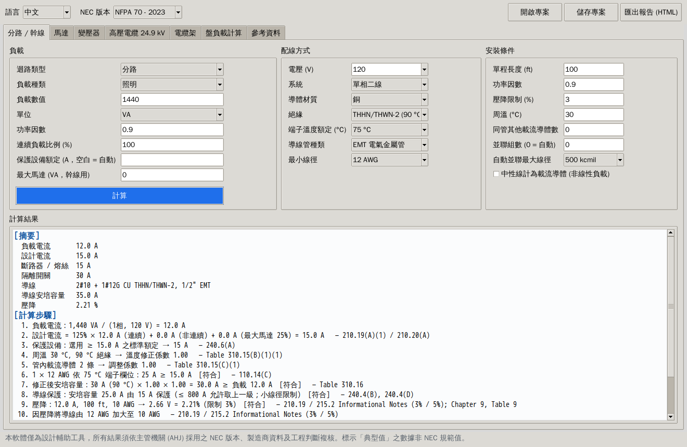
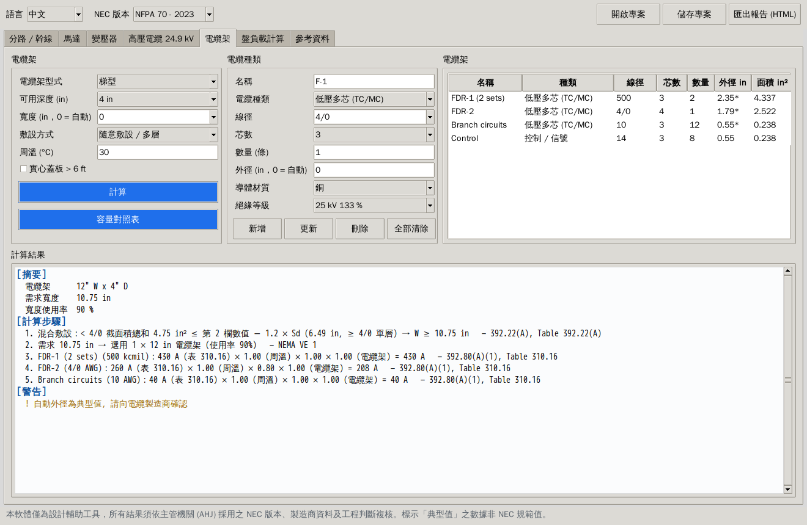
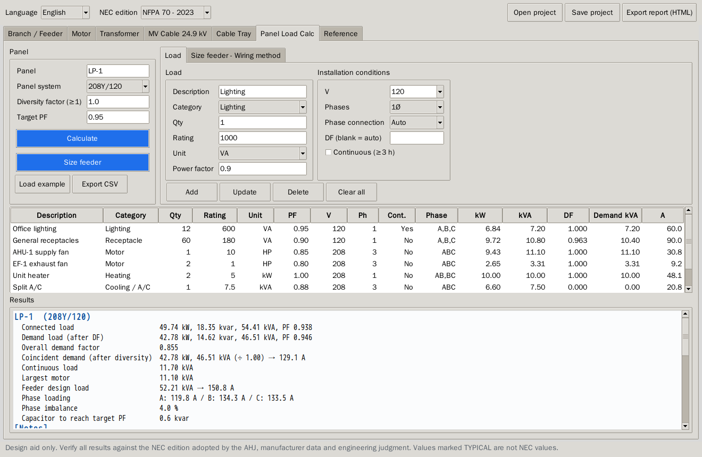

# NEC Electrical Design Calculator · NEC 電氣設計計算軟體

A design tool for US projects, from **24.9 kV three-phase** down to **120 V single-phase** equipment circuits (motors, lighting, electric heat, receptacles), based on **NFPA 70 (NEC) 2023 / 2026**. The interface switches between **English and Traditional Chinese (中文)**.

美國專案電氣設計計算工具，涵蓋 **24.9 kV 三相**到 **120 V 單相**設備迴路（馬達、燈具、電熱、插座），依 **NEC 2023 / 2026** 選定開關、線徑、管徑及電纜架，並計算負載。介面可切換**中文／英文**。

Pure Python with **no third-party packages** (Tkinter GUI from the standard library).
純 Python，**不需安裝任何套件**（GUI 使用內建 Tkinter）。



| Cable tray 電纜架 | Panel load calc |
|---|---|
|  |  |

---

## Features · 功能

| Module 模組 | What it does 內容 | NEC |
|---|---|---|
| **Branch / Feeder 分路／幹線** | Load in VA/kVA/W/kW/A with PF. Applies 125 % to continuous load and 25 % to the largest motor, then picks the standard OCPD, conductor, EGC, conduit and disconnect, and checks voltage drop. 依功因換算負載，連續負載 ×125 %、最大馬達 +25 %，選定標準保護設備、導線、接地線、導線管、開關，並檢查壓降。 | 210.19/210.20, 215.2/215.3, 240.4(B)(D), 240.6(A), 110.14(C), 310.15, 310.16, 250.122(B)(F), Ch. 9 Tables 1/4/5/9 |
| **Motor 馬達** | FLC from the NEC tables, 125 % conductors, maximum SC/GF device by type (ITCB, TD fuse, NTD fuse, MCP), overload setting, and an HP-rated disconnect. 查表 FLC、125 % 導線、依保護設備型式之上限、過載設定、馬力額定開關。 | 430.6, 430.22, 430.32, Table 430.52, 430.110, Tables 430.248/250 |
| **Transformer 變壓器** | Primary and secondary FLA, secondary bolted fault, and maximum/selected OCPD (> 1000 V and ≤ 1000 V). For a 24.9 kV primary it sizes the MV cable; otherwise it sizes the LV primary and secondary conductors. 一、二次額定電流、短路電流、保護上限與選定值；24.9 kV 一次側自動選高壓電纜。 | Table 450.3(A), Table 450.3(B), 240.21(C) |
| **Busway 匯流排槽 (Schneider I-Line)** | Choose busway instead of cable for any feeder: transformer secondary, Branch/Feeder tab or panel feeder. The data comes from Schneider Electric I-Line catalog 5600CT9101 (03/2018): R / X per rating (Table 5, 80 °C), SCCR by feeder/plug-in × standard/high bracing (Table 1), and ground-bus resistance (Table 6). Ratings are Al 225–4000 A and Cu 225–5000 A, with feeder construction from 800 A. Above the largest rating, 2 parallel runs are used (e.g. 6000 A = 2 × 3000 A). The OCPD rule follows 368.17(A). Other features: 40 °C ambient derating, harmonic-rated X/Y, G/GG ground, concentrated or distributed load voltage drop, automatic high-bracing selection against the available fault, and an I-Line catalog prefix (e.g. `CPH2540G`). 任何幹線可改選匯流排槽，採施耐德 I-Line 型錄 5600CT9101 之 R/X（表 5）、短路耐受（表 1，標準/高耐受）、接地匯流排電阻（表 6）；鋁 225–4000 A、銅 225–5000 A，6000 A 以 2 路並聯；依 368.17(A) 檢核保護設備；自動依故障電流選高耐受 (H) 並產生 I-Line 型號字首。 | 368.10, 368.12, 368.17(A)(C), 368.30, 368.60, 240.4(B), 110.10 |
| **Short Circuit / IC 短路 / IC 值** | Calculates the available fault current along a radial path (utility → transformer → cable / busway → downstream transformer → panel) by the ohmic method, using Table 9 and I-Line R/X with R corrected to 25 °C. Optional −10 % transformer Z tolerance and 4 × FLC motor contribution. The X/R asymmetry factor per IEEE 1015 is applied for MCCB / ICCB / LVPCB / fuse test X/R. Gives the minimum interrupting rating at each bus, checks the selected rating, and adds a 110.24 marking note. 放射路徑短路電流（歐姆法），各匯流排最小啟斷容量 (IC) 與 X/R 非對稱修正、選用 IC 檢核。 | 110.9, 110.10, 110.24, 240.86; IEEE 141 / 1015 |
| **Harmonics / Filters 諧波 / 濾波器** | VFD front ends: 6-pulse (none / 3 % / 5 % reactor / DC choke), 12-pulse, 18-pulse, AFE, passive filter. Uses typical spectra (or manufacturer THDi) and arithmetic summation at the PCC. Outputs current TDD and individual limits per Isc/IL, estimated voltage THD, and transformer K-factor. Mitigation options are compared (5 % reactor, passive filter, 18-pulse), and an active harmonic filter is sized to 90 % of the limits (AccuSine PCS+ frames 60/120/200/300 A, typical). 變頻器諧波：TDD、個別諧波、電壓 THD、K 因數、改善方案比較與主動濾波器容量。 | IEEE 519-2022 Tables 1–2, IEEE C57.110 |
| **MV Cable 24.9 kV 高壓電纜** | Minimum size by voltage, design ampacity, short-circuit withstand (ICEA), conductor protection (fuse ≤ 3×, relay ≤ 6×), EGC, conduit fill and jam ratio. 依電壓最小線徑、安培容量、短路耐受、導線保護、接地線、管填充、卡線比。 | 315.10, 315.60, 240.101(A) → Art. 245 (2026), 250.190(C)(3) |
| **Cable Tray 電纜架** | Ladder, ventilated-trough and solid-bottom trays with any mix of LV multiconductor, LV single-conductor, control and MV cables. Sizes the tray width; MV and LV in one tray require a barrier. Gives ampacity in tray (covered or spaced) and a **capacity table** (max cables per 6"–36" width). 梯型／通風槽／實底電纜架；低壓多芯、低壓單芯、控制、中壓電纜混合敷設寬度選定；中低壓同架隔板檢查；蓋板／間距安培容量修正；**容量對照表**。 | 392.10, 392.20(B), 392.22(A)(B)(C), Tables 392.22(A)/(B)(1), 392.80, Table 310.17 |
| **Panel Load Calc 盤負載計算** | Per-load kW/kvar/kVA from PF. Demand factor: automatic receptacle 10 kVA + 50 % and non-coincident heating/cooling, or a manual DF. Diversity factor, automatic phase balancing, imbalance %, capacitor kvar to reach the target PF, and feeder sizing. Exports to CSV. 功率因數、需量因數（自動或自訂）、參差因數、自動平衡相位、不平衡率、功因改善電容、幹線選定、CSV 匯出。 | 220.47, 220.50, 220.60, 430.24, 215.2 |
| **Reference 參考資料** | Built-in NEC tables for checking the data. 內建 NEC 表格，可直接檢視核對。 | 310.16, 310.17, 250.122, Ch. 9, 430, 450.3(A), 392.22 |

Other features · 其他：
- One-click switch between **NEC 2023 and NEC 2026**. The calculation method is the same for ≤ 1000 V. For > 1000 V the code references follow the 2026 move into the new Articles 235 and 245. 一鍵切換 NEC 2023 / 2026。
- **HTML report** export with inputs, results, numbered calculation steps and NEC references, in the selected language. 匯出 HTML 計算書（含輸入、結果、步驟與條文）。
- Save and open projects as JSON. 專案存檔／開啟。

## Mobile web version · 手機網頁版

`web/` holds a phone-friendly version that runs in any browser (iPhone, Android, tablet, PC) with nothing to install. It covers the same six modules: branch/feeder, motor, transformer, MV cable, cable tray and panel load calculation. It also switches between 中文/EN and NEC 2023/2026.
`web/` 為手機版網頁，iPhone / Android / 平板 / 電腦瀏覽器皆可直接使用，不需安裝，功能與桌面版相同（分路、馬達、變壓器、高壓電纜、電纜架、盤負載），可切換中英文與 NEC 版本。

- `web/necalc.js` is a line-for-line JavaScript port of the Python engine.
- `web/necalc_data.js` is generated from `necalc/tables.py`, `codes.py` and `i18n.py` by `python web/build_data.py`, so both versions use the same NEC data and wording.
- `web/crosscheck.py` and `web/crosscheck.js` run thousands of random cases through both engines and require every number and every sentence (English and Chinese) to match. `tests/test_web_crosscheck.py` runs this whenever Node.js is installed.

```bash
python web/build_data.py            # after editing tables / codes / i18n
python web/crosscheck.py 1500 && node web/crosscheck.js
```

To try it locally, open `web/index.html` in a browser.
本機使用：直接用瀏覽器開啟 `web/index.html`。

## Quick start · 快速開始

```bash
# Python 3.9+  (Windows / macOS: Tkinter is included with python.org installers)
cd nec-calc
python run_gui.py            # GUI 圖形介面
python -m necalc             # same 同上

python examples/system_24900_to_120.py zh 2026   # 24.9 kV → 120 V example in Chinese, NEC 2026
python -m unittest discover -s tests             # run tests 執行測試
```

### Use as a Python library · 當作 Python 函式庫使用

```python
from necalc import engine as E, loads as L, tray as TR, report as R

w = E.WiringInput(voltage=480, wiring="3ph3w", length_ft=200, pf=0.85)
res = E.design_motor("30", w, device="itcb")
print(R.to_text(res, "zh"))          # or "en"
print(res.summary["wire_text"])      # 3#8 + 1#8G CU THHN/THWN-2, 3/4" EMT

tray = TR.TrayInput(tray_type="ladder", cables=[
    TR.TrayCable("FDR-1", "lv_multi", "500", n_cond=3, qty=2),
    TR.TrayCable("MV-1", "mv_single", "1/0", n_cond=1, qty=3)])
print(R.to_text(TR.design_tray(tray), "en"))
print(TR.capacity_table("lv_multi", sizes=["12", "4/0", "500"]))
```

## Design rules used · 設計邏輯

**Conductor selection 導線選定** (`engine.size_conductors`). The smallest size that passes all of these checks:
1. Ampacity in the termination temperature column (60/75/90 °C, 110.14(C)) ≥ design current (125 % continuous + 100 % non-continuous [+25 % largest motor]).
2. 90 °C ampacity × ambient correction × CCC adjustment ≥ actual load current.
3. Conductor protected by its OCPD. The next standard size up is allowed at ≤ 800 A (240.4(B)); above 800 A ampacity must be ≥ the OCPD. Small-conductor limits apply (240.4(D)). Motor circuits are exempt per 240.4(G).
4. Parallel sets are added automatically once the size passes the chosen maximum (default 500 kcmil). Each set is at least 1/0 and runs in its own raceway with a full-size EGC.
5. If voltage drop (Chapter 9 Table 9, effective Z = R·cosθ + X·sinθ) exceeds the limit, the conductor is upsized and the EGC is increased in proportion (250.122(B)).

**Cable tray 電纜架** (`tray.design_tray`). Cables are grouped as LV multiconductor/control (392.22(A)), LV single conductor (392.22(B)(1)) and MV (392.22(C)). The required widths of the groups are added together (a barrier is required when MV and LV share a tray). The smallest NEMA VE 1 width (6, 9, 12, 18, 24, 30, 36 in) that fits is selected.
> Note: Table 392.22 and NEMA VE 1 list only the standard widths 6/9/12/18/24/30/36 in. A non-standard width such as 15" can be entered in "Width". Its allowable fill is interpolated and flagged.
> 註：表 392.22 及 NEMA VE 1 標準寬度為 6/9/12/18/24/30/36 in；15" 等非標準寬度可於「寬度」欄輸入，程式以內插計算並提示。

## Data sources & limitations · 資料來源與限制

- NEC values are in `necalc/tables.py`. Code references for each edition are in `necalc/codes.py`. Both are plain data and easy to audit or adjust.
  NEC 數值集中在 `tables.py`，條文編號在 `codes.py`，皆可自行稽核修改。
- Values marked **TYPICAL** are **not NEC values** and the program prints a warning whenever it uses them. Verify them with NEC 315.60 or the cable manufacturer:
  標示 **TYPICAL（典型值）** 的資料非 NEC 規範值，使用時程式會發出警告，請以 NEC 315.60 或製造商資料確認：
  - MV cable ampacity (in duct and in free air) and OD 高壓電纜安培容量與外徑
  - Type TC multiconductor cable OD TC 多芯電纜外徑
  - Typical E-rated MV fuse ratings 高壓 E 級熔絲額定
- Busway data is Schneider Electric I-Line (catalog 5600CT9101, 03/2018), and I-Line catalog prefixes are generated by the program. Confirm both with Schneider Electric for each project. To use another manufacturer's busway, enter its R / X / SCCR.
  匯流排槽資料取自施耐德 I-Line 型錄 5600CT9101（2018/03），型號字首由程式產生，請於專案時向原廠確認；其他廠牌請輸入該廠 R / X / SCCR。
- The short-circuit module covers a single radial path, 3-phase bolted faults, and a 4 × FLC motor contribution. The harmonic module uses typical spectra with arithmetic summation and does not model resonance with capacitors. For network-wide fault, line-to-ground fault, arc flash, coordination and harmonic resonance studies, use ETAP. Dwelling-unit (Article 220 Part III/IV) calculations are not included.
  短路模組為單一放射路徑、三相短路、馬達 4 倍 FLC；諧波模組採典型頻譜與算術加總，未含電容器諧振。完整系統短路、單相接地、電弧閃絡、保護協調與諧振分析請用 ETAP。
- **This is a design aid. Every result must be checked by a qualified engineer against the edition the AHJ has adopted.**
  **本軟體為設計輔助工具，結果須由合格工程師依 AHJ 採用版本複核。**

## Project layout · 專案結構

```
nec-calc/
├── run_gui.py              GUI launcher
├── necalc/
│   ├── tables.py           NEC tables (310.16/17, 250.122, Ch.9, 430, 450, 392 …)
│   ├── codes.py            Section references per edition (2023 / 2026)
│   ├── engine.py           Conductor/OCPD/EGC/conduit/VD, motor, transformer, MV
│   ├── tray.py             Cable tray (Article 392)
│   ├── shortcircuit.py     Available fault current / IC rating (110.9, 110.24)
│   ├── harmonics.py        VFD harmonics, IEEE 519, filters
│   ├── loads.py            Panel load calculation (PF, DF, diversity)
│   ├── i18n.py             English / 中文 text
│   ├── report.py           Text / HTML / CSV output
│   └── gui.py              Tkinter GUI
├── web/                    Mobile web version (JS port + cross-check vs Python)
├── examples/system_24900_to_120.py
└── tests/
```
